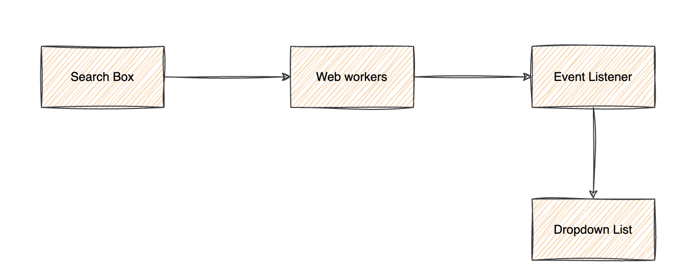

# Web workers - Your heavy duty helper
## Introduction
This project demonstrate the capabilities of web workers.
The main idea behind web worker is to create a thread independent from the ui thread and do the heavy duty calculation on that particular thread.

# Key Features of web workers
- It can accept multiple processing request using `postMessage` and return it through `onmessage`

- Create a different javascript engine all together independent from the ui thread. It helps to keep application ui respondent even if application is performing the heavy duty operations 

# Limitation of web workers
- It can't access dom
- Can only communicate through message passing

# Project Information
This project is a simulation of very large amount of data processing by a web browser and still keeping the ui thread respondant.

## Architecture

## Running Project
This is a vanilla javascript project built with the help of webpack build tool.

### Install
```bash
npm install
```

### Serve
```bash
npm run serve
```
This command will create a server at 8080 (if port not busy) and host the index.html

### Build Project
```bash
npm run build
```
This command will create a dist folder containing all the artifacts
